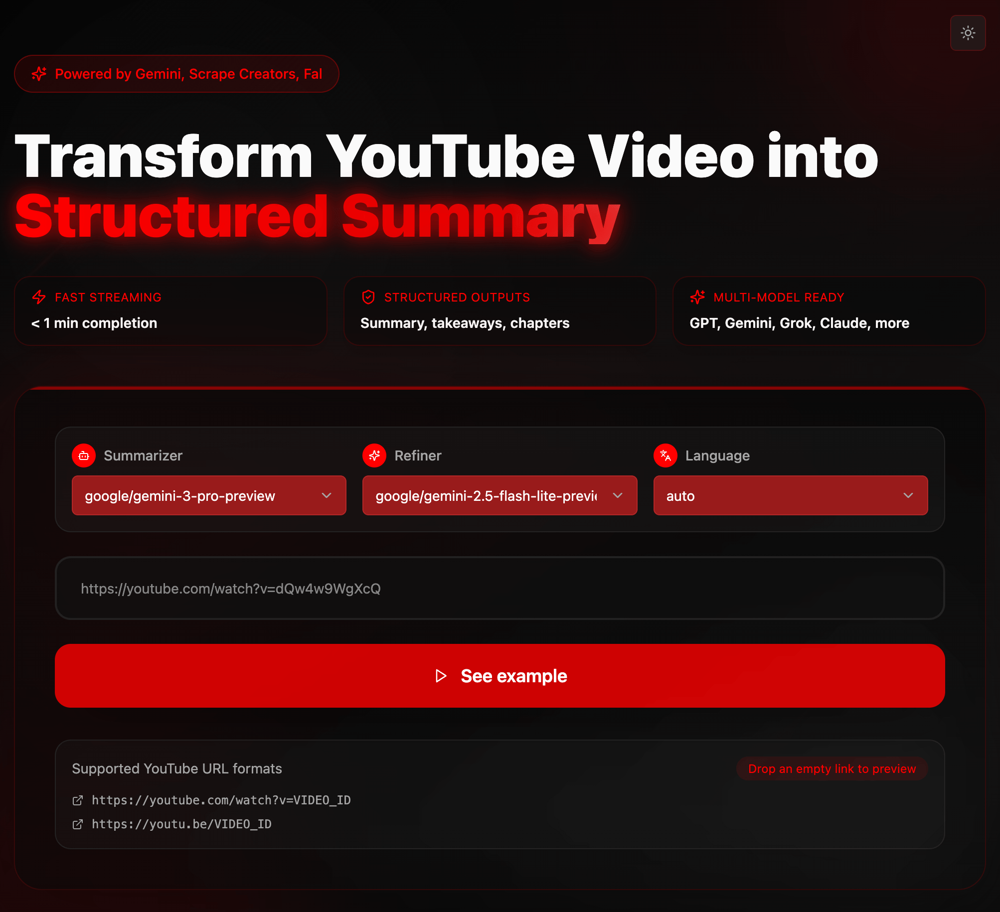

# YouTube Summarizer UI



Static demo: https://teron131.github.io/youtube-summarizer-ui
Backend: https://github.com/teron131/youtube-summarizer

A modern full-stack application that transforms YouTube videos into concise AI summaries and transcripts.

## 🚀 Features

- **YouTube Intelligence**: Automated metadata and transcript extraction for any video.
- **AI Analysis**: High-quality summarization with multi-model support and quality self-checking.
- **Transcriptions**: Automated speech-to-text for videos without existing captions.
- **Real-time Experience**: Live processing logs and a responsive, modern interface.
- **Reliability**: Comprehensive error handling and cross-platform support.

## 📋 Prerequisites

- **Node.js 18+**
- **Python 3.8+**
- **API Keys** (at least one required):
  - **ScrapeCreators API key** ([Get here](https://scrapecreators.com/)) - For video scraping
  - **OpenRouter API key** ([Get here](https://openrouter.ai/)) - For AI models (Grok, Claude, etc.)
  - **OR** Google Gemini API key ([Get here](https://ai.google.dev/)) - Alternative for AI analysis
  - FAL AI API key ([Get here](https://fal.ai/)) - Optional, for audio transcription fallback

## 🚀 Quick Start

### 1. Clone and Install

```bash
git clone <repository-url>
cd youtube-summarizer-ui

# Install frontend dependencies
bun install

# Install Python dependencies
cd youtube-summarizer
uv sync
cd ..
```

### 2. Environment Configuration

Copy the example environment file and add your API keys:

```bash
cp youtube-summarizer/.env_example youtube-summarizer/.env
```

Edit `youtube-summarizer/.env` with your API keys:

```env
# Required
SCRAPECREATORS_API_KEY=your_scrapecreators_api_key_here

# AI Models (at least one required)
OPENROUTER_API_KEY=your_openrouter_api_key_here
# OR
GEMINI_API_KEY=your_gemini_api_key_here

# Optional
FAL_KEY=your_fal_api_key_here
```

### 3. Run the Application

#### Option A: Full Stack (Recommended)
Run both frontend and backend simultaneously:

```bash
./start.sh
```

This starts:
- Backend API at `http://localhost:8001`
- Frontend UI at `http://localhost:5173`
- API Docs at `http://localhost:8001/docs`

#### Option B: Individual Services

**Backend only:**
```bash
cd youtube-summarizer
uv run python -m uvicorn app:app --host 0.0.0.0 --port 8001 --reload
```

**Frontend only:**
```bash
bun run dev
```

#### Option C: Stop All Services
```bash
./stop.sh
```

### 4. Usage

1. Open `http://localhost:5173` in your browser
2. Paste a YouTube URL (e.g., `https://youtube.com/watch?v=VIDEO_ID`)
3. Click "Summarize Video"
4. Watch real-time processing logs
5. Review the generated transcript and AI summary

## 🚀 Railway Deployment

1. **Frontend**: Deploy from root directory.
2. **Backend**: Deploy from `youtube-summarizer/` directory.
3. **Environment Variables**: Set the following in your deployment dashboard:
   - `GEMINI_API_KEY=your_actual_key`
   - `FAL_KEY=your_actual_key`
4. **Access**: Your app will be available at the provided domain.

## 🔧 Development

### Frontend Development
```bash
bun run dev            # Start frontend development server
bun run build          # Build for production
bun run preview        # Preview production build
bun run lint           # Lint code
```

## ⚙️ Configuration

### Supported YouTube URL Formats
- `https://youtube.com/watch?v=VIDEO_ID`
- `https://youtu.be/VIDEO_ID`
- `https://youtube.com/embed/VIDEO_ID`

