# YouTube Summarizer


Static demo: https://teron131.github.io/youtube-summarizer-ui
Backend: https://github.com/teron131/youtube-summarizer

A modern full-stack application that solves the difficulty of accessing YouTube content and generating customized, detailed summaries using a robust multi-tier processing architecture.

> **Note:** This problem is now deprecating.

## 🌟 Key Features

- **🎯 Master Orchestrator**: Single `/api/generate` endpoint managing the entire pipeline.
- **🔄 Multi-Tier Processing**: Primary scraper → Fallback (yt-dlp + AI transcription) → LangGraph AI.
- **🎤 Smart Transcription**: Prioritizes direct transcript extraction, falls back to automated speech-to-text.
- **🤖 AI Summarization**: LangGraph-powered self-checking workflow with Gemini/OpenRouter support.
- **🛡️ Robust Operations**: Detailed logging, real-time progress, and graceful degradation.
- **⚡ Performance**: Optimized for asynchronous processing with real-time feedback.

## 📊 Transcript Extraction Comparison

The system evaluates multiple transcription methods based on robustness and speed to ensure maximum reliability.

| Method | Type | Robustness | Speed | Notes |
|--------|------|------------|-------|-------|
| **Premium API** | **Direct** | ⭐⭐⭐⭐⭐ | ⚡ Fast | **Primary**. Extracts official/auto-captions directly. |
| **yt-dlp + Fallback AI** | **Fallback** | ⭐⭐⭐ | 🐢 Slower | **Reliable Fallback**. Audio-based; prone to IP blocks/bot detection. |
| **Native AI Access** | **Direct** | ⭐⭐ | ⚡ Fast | **Not Used**. Unreliable transcript retrieval during development. |

## 🏗️ Technical Architecture

### 📊 Overall System Workflow
The system uses a 3-tier architecture to ensure analysis quality and system resilience.

```mermaid
graph TD
    A[YouTube URL] --> B[Validate URL]
    B --> C[Premium Scraper<br/>📋 Extract Video Data]
    C --> D[Get Transcript<br/>📝 Direct from YouTube]
    D --> E{Transcript Available?}
    E -->|Yes| F[LangGraph AI Workflow<br/>🔄 Self-Checking Analysis]
    E -->|No| G[Download Audio<br/>🎵 yt-dlp]
    G --> H[Transcribe Audio<br/>🎤 Fallback AI]
    H --> F
    F --> I[Return Complete Results]
    
    style C fill:#1E88E5,color:#fff
    style G fill:#F9A825,color:#000
    style H fill:#F9A825,color:#000
    style F fill:#2E7D32,color:#fff
```



### 🔄 LangGraph AI Workflow Detail
An iterative refinement loop ensures analysis meets a high quality threshold (90%+).


## 📋 Prerequisites

- **Node.js 18+**
- **Python 3.8+**
- **API Keys** (at least one required):
  - **ScrapeCreators API key** - For video scraping
  - **OpenRouter API key** - For AI models (Grok, Claude, etc.)
  - **OR** Google Gemini API key - Alternative for AI analysis
  - **FAL AI API key** - Optional, for audio transcription fallback

## 🚀 Quick Start

### 1. Clone and Install

```bash
git clone <repository-url>
cd youtube-summarizer-ui

# Install frontend dependencies
bun install

# Install Python dependencies
cd youtube-summarizer
uv sync
cd ..
```

### 2. Environment Configuration

Copy the example environment file and add your API keys:

```bash
cp youtube-summarizer/.env_example youtube-summarizer/.env
```

Edit `youtube-summarizer/.env` with your API keys.

### 3. Run the Application

#### Option A: Full Stack (Recommended)
Run both frontend and backend simultaneously:

```bash
./start.sh
```

#### Option B: Individual Services

**Backend only:**
```bash
cd youtube-summarizer
uv run python -m uvicorn app:app --host 0.0.0.0 --port 8001 --reload
```

**Frontend only:**
```bash
bun run dev
```

### 4. Usage

1. Open `http://localhost:5173` in your browser.
2. Paste a YouTube URL.
3. Click "Summarize Video".
4. Watch real-time processing logs.
5. Review the generated transcript and AI summary.

## 🚀 Railway Deployment

1. **Frontend**: Deploy from root directory.
2. **Backend**: Deploy from `youtube-summarizer/` directory.
3. **Environment Variables**: Set the required API keys in your deployment dashboard.
4. **Access**: Your app will be available at the provided domain.

## 🔧 Development

### Frontend Development
```bash
bun run dev            # Start frontend development server
bun run build          # Build for production
bun run preview        # Preview production build
bun run lint           # Lint code
```

## ⚙️ Configuration

### Supported YouTube URL Formats
- `https://youtube.com/watch?v=VIDEO_ID`
- `https://youtu.be/VIDEO_ID`
- `https://youtube.com/embed/VIDEO_ID`
